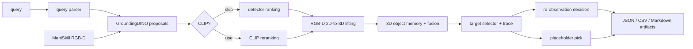

# Query-to-Grasp

Language-queryable 3D semantic target retrieval and placeholder grasp execution
in ManiSkill.

The current project is a research prototype for a paper/demo baseline. It does
not train new models. Instead, it connects open-vocabulary 2D perception, RGB-D
geometry, confidence-aware 3D object memory, deterministic target selection, and
structured benchmark/report artifacts.

## Current Scope

Implemented:

- ManiSkill RGB-D observation wrapper and export utilities.
- Query parser with deterministic fallback rules.
- GroundingDINO detector wrapper with HF, original-adapter, and mock backends.
- Optional OpenCLIP reranking.
- RGB-D 2D-to-3D lifting with corrected ManiSkill `cam2world_gl` convention.
- Safe placeholder pick executor that validates targets without claiming real
  robot-control success.
- Single-view benchmark/report pipeline.
- Ambiguity benchmark helper for reranking headroom diagnostics.
- Multi-view object memory and confidence-aware fusion debug path.
- Target selection traces and open-loop re-observation policy diagnostics.
- Paper-ready table/report/figure-pack helpers.

Not implemented yet:

- Real low-level robot grasp control.
- Closed-loop camera movement after re-observation decisions.
- Web demo.
- Training code.
- Large-scale cluttered-scene evaluation.

## Architecture



See `docs/architecture_query_to_grasp.md` for the implemented architecture and
paper artifact map.

## Install

Python 3.10+ is recommended. The mock path is dependency-light; HF and ManiSkill
runs require the relevant simulation and model packages.

```bash
python -m venv .venv
source .venv/bin/activate
pip install -r requirements.txt
pip install pytest
```

On Windows PowerShell:

```powershell
python -m venv .venv
.\.venv\Scripts\Activate.ps1
pip install -r requirements.txt
pip install pytest
```

For HF GroundingDINO diagnostics:

```bash
PYTHONPATH=$PWD python scripts/check_hf_groundingdino_env.py --try-model-load
```

## Quickstart

Stable dependency-light smoke run:

```bash
PYTHONPATH=$PWD python scripts/run_single_view_pick.py \
  --query "red cube" \
  --detector-backend mock \
  --mock-box-position center \
  --skip-clip \
  --depth-scale 1000 \
  --output-dir outputs/colab_pick_smoke
```

Expected result: a structured run folder containing JSON summaries, parsed
query output, 3D target data, and a placeholder pick result. `pick_success=false`
is expected because the executor intentionally does not send low-level robot
actions.

## HF Single-View Baseline

No CLIP:

```bash
PYTHONPATH=$PWD python scripts/run_single_view_pick_benchmark.py \
  --queries "red cube" "blue mug" \
  --seeds 0 1 2 \
  --detector-backend hf \
  --skip-clip \
  --depth-scale 1000 \
  --output-dir outputs/benchmark_hf_no_clip
```

With CLIP:

```bash
PYTHONPATH=$PWD python scripts/run_single_view_pick_benchmark.py \
  --queries "red cube" "blue mug" \
  --seeds 0 1 2 \
  --detector-backend hf \
  --use-clip \
  --depth-scale 1000 \
  --output-dir outputs/benchmark_hf_with_clip
```

Generate the report:

```bash
PYTHONPATH=$PWD python scripts/generate_benchmark_report.py \
  --benchmark-dir outputs/benchmark_hf_no_clip \
  --compare-benchmark-dir outputs/benchmark_hf_with_clip
```

## Ambiguity Benchmark

The ambiguity helper reuses the single-view benchmark pipeline and loads
curated queries from `configs/ambiguity_queries.txt`.

```bash
PYTHONPATH=$PWD python scripts/run_ambiguity_benchmark.py \
  --queries-file configs/ambiguity_queries.txt \
  --seeds 0 1 2 \
  --detector-backend hf \
  --skip-clip \
  --depth-scale 1000 \
  --output-dir outputs/ambiguity_hf_no_clip \
  --generate-report
```

Run again with `--use-clip` to test whether reranking changes top-1 under
broader prompts.

## Multi-View Fusion Debug

Corrected virtual `tabletop_3` multi-view run:

```bash
PYTHONPATH=$PWD python scripts/run_multiview_fusion_debug.py \
  --query "red cube" \
  --seed 0 \
  --detector-backend hf \
  --skip-clip \
  --depth-scale 1000 \
  --view-preset tabletop_3 \
  --camera-name base_camera \
  --output-dir outputs/multiview_debug_red_cube
```

Fusion benchmark:

```bash
PYTHONPATH=$PWD python scripts/run_multiview_fusion_benchmark.py \
  --queries "red cube" "blue mug" \
  --seeds 0 1 2 \
  --detector-backend hf \
  --skip-clip \
  --depth-scale 1000 \
  --view-preset tabletop_3 \
  --camera-name base_camera \
  --output-dir outputs/multiview_fusion_tabletop3_hf_no_clip
```

Comparison table:

```bash
PYTHONPATH=$PWD python scripts/generate_fusion_comparison_table.py \
  --single-view "HF single no CLIP=outputs/benchmark_hf_no_clip" \
  --fusion "HF tabletop_3 fusion no CLIP=outputs/multiview_fusion_tabletop3_hf_no_clip" \
  --output-md outputs/fusion_comparison_table.md \
  --output-csv outputs/fusion_comparison_table.csv
```

## Re-Observation Diagnostics

The policy currently produces a decision artifact; it does not automatically
move cameras and rerun perception.

```bash
PYTHONPATH=$PWD python scripts/generate_reobserve_policy_report.py \
  --benchmark HF_no_CLIP=outputs/multiview_fusion_tabletop3_hf_no_clip \
  --benchmark HF_with_CLIP=outputs/multiview_fusion_tabletop3_hf_with_clip \
  --output-md outputs/reobserve_policy_report.md \
  --output-json outputs/reobserve_policy_report.json
```

Post-selection continuity margin sweep:

```bash
PYTHONPATH=$PWD python scripts/run_post_selection_margin_sweep.py \
  --queries-file configs/ambiguity_queries_compact.txt \
  --seeds 0 \
  --detector-backend hf \
  --use-clip \
  --depth-scale 1000 \
  --view-preset tabletop_3 \
  --camera-name base_camera \
  --output-dir outputs/post_selection_margin_sweep_with_clip \
  --generate-policy-report \
  --fail-on-child-error
```

## H200 Sync Workflow

For H200 runs, keep the local workspace and remote `OpenMythos_test` tree in
sync with the checked-in helpers in `scripts/`.

Push changed repo files to the remote workspace:

```powershell
$env:SSH_KEY_PASSPHRASE = "..."
powershell -ExecutionPolicy Bypass -File scripts/sync_h200_files.ps1 `
  -Direction push `
  -Paths @("scripts/run_multiview_fusion_benchmark.py", "src/policy/target_selector.py")
```

Pull a benchmark/report directory back to local `outputs/`:

```powershell
$env:SSH_KEY_PASSPHRASE = "..."
powershell -ExecutionPolicy Bypass -File scripts/sync_h200_files.ps1 `
  -Direction pull `
  -Recursive `
  -Paths @("outputs/h200_60071_post_selection_continuity_ambiguity_compact_seed0")
```

Run a non-interactive remote command from the same SSH setup:

```powershell
$env:SSH_KEY_PASSPHRASE = "..."
powershell -ExecutionPolicy Bypass -File scripts/invoke_h200_command.ps1 `
  -RemoteCommand "source ~/q2g_venv/bin/activate && python --version"
```

## Paper Figure Pack

Collect the current paper/demo artifacts into one captioned folder:

```bash
PYTHONPATH=$PWD python scripts/build_paper_figure_pack.py \
  --output-dir outputs/paper_figure_pack_latest
```

The pack includes the architecture note, ablation tables, geometry reports,
memory diagnostics, selection trace, re-observation report, and milestone log
when those source artifacts are present.

## Current Evidence Summary

Current H200 benchmark evidence supports these conservative conclusions:

- HF GroundingDINO is runnable for the small single-view baseline.
- CLIP does not currently change top-1 because detector candidate multiplicity
  remains low.
- Ambiguity prompts raise candidate count only modestly in the tested setting.
- Correcting the RGB-D/camera-pose convention reduces same-label cross-view
  spread from `1.0693 m` to `0.0518 m`.
- Corrected `tabletop_3` fusion reduces mean memory fragmentation from `3.3333`
  to `1.3333` objects per run in the current small benchmark.
- CLIP increases selected-object confidence in corrected fusion, but does not
  change selected-object rate or re-observation decisions in the current runs.

See `docs/paper_milestone_log.md` and `docs/paper_draft_outline.md` for the
running paper-oriented record.

## Testing

Run the lightweight suite:

```bash
PYTHONPATH=$PWD pytest -q tests
```

Model-download and ManiSkill-heavy commands should be treated as environment
smoke/integration runs rather than unit tests.

## Known Limitations

- Placeholder pick is intentionally not real grasp control.
- Re-observation is open-loop diagnostics only.
- The web demo is not implemented yet.
- Experiments are still small and centered on `PickCube-v1` plus virtual camera
  presets.
- CLIP is currently a confidence/diagnostic term, not a proven performance
  improvement.
