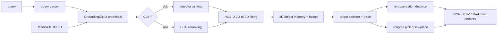

# Query-to-Grasp

**A Target-Source Diagnostic Framework for Open-Vocabulary RGB-D Manipulation**

This repository contains the code, benchmark scripts, generated summaries,
and paper artifacts for the Query-to-Grasp diagnostic framework.

**Paper status:** Submitted to *Robotics and Autonomous Systems*.

---

## Overview

Open-vocabulary detectors can localize language-described objects in 2D, but
robot manipulation requires a geometrically stable, cross-view consistent, and
executable 3D action target. Query-to-Grasp studies this
**retrieval-to-execution interface** explicitly: it keeps semantic retrieval,
RGB-D lifting, camera-frame alignment, target-source selection, multi-view
memory, re-observation, and scripted execution as separable modules.

This framework is a **simulated diagnostic benchmark** for studying
open-vocabulary RGB-D manipulation. It does **not** claim real-robot deployment.

---

## Repository Structure

```
Query-to-Grasp/
├── src/                    # Core Python source
│   ├── env/                # ManiSkill environment wrapper
│   ├── perception/         # GroundingDINO, CLIP reranking, mask projection, query parsing
│   ├── geometry/           # 3D geometry utilities
│   ├── memory/             # Multi-view 3D object memory
│   ├── policy/             # Target selection and re-observation policy
│   ├── manipulation/       # Scripted pick/pick-place executors
│   ├── eval/               # Metrics computation
│   └── io/                 # I/O utilities
├── scripts/                # Benchmark runners, table/figure generation
├── tests/                  # Unit and integration tests
├── configs/                # Query configuration files
├── paper_ras/              # Paper LaTeX source (RAS submission)
│   ├── main.tex
│   ├── references.bib
│   ├── figures/            # Vector and raster figures for paper
│   └── tables/             # Generated LaTeX and CSV tables
├── docs/                   # Architecture documentation, experiment reports
├── notebooks/              # Jupyter debug notebooks
├── requirements.txt        # Python dependencies
└── LICENSE                 # MIT License
```

---

## Architecture



See [`docs/architecture_query_to_grasp.md`](docs/architecture_query_to_grasp.md)
for the implemented architecture and paper artifact map.

---

## Installation

Python 3.10+ is recommended.

```bash
python -m venv .venv
source .venv/bin/activate   # Linux/macOS
# .\\.venv\\Scripts\\Activate.ps1   # Windows PowerShell
pip install -r requirements.txt
pip install pytest
```

> **Note:** Exact large-scale experiments were run on a GPU cluster. Cluster-specific SSH, synchronization, and launch scripts are excluded from the public artifact for security and portability.

---

## Quickstart

Dependency-light smoke run (mock detector, no GPU needed):

```bash
PYTHONPATH=$PWD python scripts/run_single_view_pick.py \
  --query "red cube" \
  --detector-backend mock \
  --mock-box-position center \
  --skip-clip \
  --depth-scale 1000 \
  --output-dir outputs/smoke_pick
```

Expected: a structured run folder with JSON summaries, parsed query output, 3D
target data, and a placeholder pick result. `pick_success=false` is expected
because the placeholder executor does not send low-level robot actions.

---

## Reproducing Paper Tables and Figures

### Generate tables

The paper tables are generated from benchmark summary CSVs:

```bash
PYTHONPATH=$PWD python scripts/generate_ras_tables_figures.py
```

Pre-generated tables are in `paper_ras/tables/`:
- `table_external_crop_200_with_ci.tex` — External RGB-D crop baselines
- `table_noisy_oracle_with_ci.tex` — Noisy-oracle sensitivity
- `table_noncube_gate_with_ci.tex` — Non-cube PickSingleYCB diagnostic
- `table_target_ladder_with_ci.tex` — Target-source ladder
- `table_sensor_stress_with_ci.tex` — Synthetic RGB-D stress test
- `table_failure_taxonomy.tex` — Failure taxonomy

### Generate figures

```bash
PYTHONPATH=$PWD python scripts/generate_paper_figures.py
```

Pre-generated figures are in `paper_ras/figures/`.

### Compile paper

```bash
cd paper_ras
latexmk -pdf main.tex
```

---

## Data and Artifacts

### Included

- **Benchmark summary CSVs/JSONs**: Lightweight summaries used to generate
  paper tables and figures.
- **Generated LaTeX tables**: Ready-to-compile table fragments.
- **Generated figures**: PDF and PNG versions of all paper figures.
- **Table/figure generation scripts**: Python scripts that reproduce the paper's
  tables and figures from the included summaries.

### Excluded

- **Raw massive outputs**: Per-run observation images, depth maps, and detection
  overlays (tens of thousands of files) are not included.
- **Model weights**: GroundingDINO and CLIP weights should be obtained through
  HuggingFace.
- **External assets**: ManiSkill and YCB assets should be obtained from their
  official sources and are not redistributed in this repository.
- **Cluster-specific launch scripts**: SSH, synchronization, and remote
  execution scripts are excluded for security and portability.

---

## Claim Boundary

This repository supports a **simulated diagnostic framework**. It does **not**
claim real-robot deployment or general manipulation competence. The scripted
executor is a diagnostic instrument: it fixes the control layer so that
differences in measured performance can be attributed to target-source quality.

---

## Running Benchmarks

### Single-view pick benchmark

```bash
PYTHONPATH=$PWD python scripts/run_single_view_pick_benchmark.py \
  --queries "red cube" "blue mug" \
  --seeds 0 1 2 \
  --detector-backend hf \
  --skip-clip \
  --depth-scale 1000 \
  --output-dir outputs/benchmark_hf_no_clip
```

### Ambiguity benchmark

```bash
PYTHONPATH=$PWD python scripts/run_ambiguity_benchmark.py \
  --queries-file configs/ambiguity_queries.txt \
  --seeds 0 1 2 \
  --detector-backend hf \
  --skip-clip \
  --depth-scale 1000 \
  --output-dir outputs/ambiguity_hf_no_clip \
  --generate-report
```

---

## Testing

```bash
PYTHONPATH=$PWD pytest -q tests
```

---

## Known Limitations

- All experiments are simulated (ManiSkill); no physical robot results.
- The scripted executor is intentionally limited to isolate target-source
  effects.
- Re-observation is open-loop diagnostics only.
- Language grounding uses simple queries, not relation-heavy reasoning.
- Experiments are centered on PickCube, StackCube, and PickSingleYCB tasks.

---

## Citation

```bibtex
@article{chen2026querytograsp,
  title   = {Query-to-Grasp: A Target-Source Diagnostic Framework
             for Open-Vocabulary RGB-D Manipulation},
  author  = {Chen, Zhuo},
  journal = {Robotics and Autonomous Systems},
  year    = {2026},
  note    = {Submitted manuscript}
}
```

---

## License

This project is licensed under the MIT License. See [LICENSE](LICENSE) for
details.

External assets such as ManiSkill/YCB assets should be obtained from their
official sources and are not redistributed in this repository.
