# Query-to-Grasp Implemented Architecture

This note records the architecture that is currently implemented and tested.
It is intended as a paper/demo support artifact, not as a future-roadmap wish
list.

## Pipeline Diagram

```mermaid
flowchart LR
    Q["Natural-language query"] --> Parser["Rule query parser<br/>src/perception/query_parser.py"]
    Parser --> Prompt["Normalized prompt"]

    Env["ManiSkill RGB-D observation<br/>src/env/maniskill_env.py"] --> Obs["RGB, depth, intrinsics, extrinsics"]
    Obs --> Detector["GroundingDINO detector<br/>HF / original / mock"]
    Prompt --> Detector

    Detector --> ClipGate{"CLIP enabled?"}
    ClipGate -->|skip-clip| DetRank["Detector-score ranking"]
    ClipGate -->|use-clip| ClipRank["OpenCLIP crop reranking<br/>src/perception/clip_rerank.py"]

    DetRank --> Lift["2D-to-3D lifting<br/>src/perception/mask_projector.py"]
    ClipRank --> Lift
    Obs --> Lift

    Lift --> SingleTarget["Single-view 3D target"]
    Lift --> Memory["ObjectMemory3D<br/>src/memory/object_memory_3d.py"]
    Memory --> Fusion["Confidence-aware fusion<br/>src/memory/fusion.py"]
    Fusion --> Selector["Target selector + trace<br/>src/policy/target_selector.py"]
    Selector --> Reobserve["Rule-based re-observation decision<br/>src/policy/reobserve_policy.py"]

    SingleTarget --> PickExec{"Pick executor<br/>mode?"}
    Selector --> PickExec
    Reobserve --> PickExec

    PickExec -->|placeholder| Placeholder["SafePlaceholderPickExecutor<br/>src/manipulation/pick_executor.py"]
    PickExec -->|sim_topdown| SimPick["SimulatedTopDownPickExecutor<br/>src/manipulation/sim_topdown_executor.py"]
    PickExec -->|sim_pick_place| SimPickPlace["SimPickPlaceExecutor<br/>src/manipulation/sim_pick_place_executor.py"]

    SimPickPlace --> PlaceTarget{"Place target<br/>source?"}
    PlaceTarget -->|oracle_cubeB_pose| OraclePlace["Privileged cubeB pose<br/>src/manipulation/oracle_targets.py"]
    PlaceTarget -->|predicted_place_object| PredPlace["Perception-derived place target<br/>src/manipulation/place_targets.py"]

    Placeholder --> Artifacts["JSON / CSV / Markdown artifacts"]
    SimPick --> Artifacts
    SimPickPlace --> Artifacts
```

## Implemented Modes

| mode | command family | purpose |
| --- | --- | --- |
| Mock single-view | `run_single_view_pick.py --detector-backend mock --skip-clip` | Stable dependency-light smoke path. |
| HF single-view | `run_single_view_pick.py --detector-backend hf` | Real GroundingDINO perception baseline. |
| Ambiguity benchmark | `run_ambiguity_benchmark.py` | Tests whether broader queries create reranking headroom. |
| Corrected multi-view fusion | `run_multiview_fusion_benchmark.py --view-preset tabletop_3` | Virtual RGB-D views and object memory fusion. |
| Closed-loop re-observation | `run_multiview_fusion_benchmark.py --enable-closed-loop-reobserve` | Confidence-policy triggered extra views. |
| Sim top-down pick | `run_single_view_pick.py --pick-executor sim_topdown` | ManiSkill PickCube/StackCube simulated pick execution. |
| Sim pick-place (oracle) | `run_single_view_pick.py --pick-executor sim_pick_place --place-target-source oracle_cubeB_pose` | Privileged place target for upper-bound stacking. |
| Sim pick-place (predicted) | `run_single_view_pick.py --pick-executor sim_pick_place --place-target-source predicted_place_object --place-query "green cube"` | Non-oracle predicted placement from perception. |
| Fusion comparison table | `generate_fusion_comparison_table.py` | Paper-ready single-view vs fusion comparisons. |
| Re-observation diagnostics | `generate_reobserve_policy_report.py` | Open-loop and closed-loop confidence-policy decisions. |
| Paper figure pack | `build_paper_figure_pack.py` | Collects paper-ready figures and evidence artifacts. |
| Demo video pack | `build_demo_video_pack.py` | Representative demo story manifest for supplemental video. |

## Target-Source Ladder

The main paper evidence is organized by target source rather than implementation history:

| level | pick target source | place target source | diagnostic scope |
| --- | --- | --- | --- |
| 1 | Oracle object pose | — | Scripted controller upper bound |
| 2 | Fused memory grasp point | — | Multi-view perception → execution |
| 3 | Task-guard semantic center | — | StackCube pick-only diagnostic |
| 4 | Oracle cubeA + oracle cubeB | Oracle cubeB | Full oracle pick-place upper bound |
| 5 | Query-derived pick target | Oracle cubeB | Query-pick + privileged-place bridge |
| 6 | Query-derived pick target | Semantic-center predicted `green cube` | Semantic predicted-place baseline |
| 7 | Query-derived pick target | Refined predicted `green cube` | **Main non-oracle result** (500 seeds) |
| 8 | Query-derived pick target | Refined predicted `cube` (broad) | Place-query specificity ablation |

## Evidence Path

The current paper evidence follows this chain:

1. HF GroundingDINO runs are debuggable and runnable with cache fallback.
2. Single-view outputs include runtime, candidate multiplicity, top-1 rerank
   changes, 3D target availability, and placeholder pick results.
3. Ambiguity benchmarks show that candidate multiplicity remains modest and
   CLIP does not currently change top-1.
4. Multi-view debugging identified a camera-frame convention mismatch between
   OpenCV-style RGB-D points and ManiSkill `cam2world_gl`.
5. Applying the OpenCV-to-OpenGL conversion before `cam2world_gl` reduced
   same-label cross-view spread from `1.0693 m` to `0.0518 m`.
6. Corrected `tabletop_3` fusion reduces memory fragmentation from `3.3333`
   to `1.3333` objects per run in the current small HF benchmark.
7. The target selector and re-observation policy now emit traceable artifacts,
   and the closed-loop policy can reduce compact ambiguity triggers.
8. The `sim_topdown` executor connects selected 3D targets to ManiSkill
   actions and lifts PickCube pick success to `1.0000` for compact and full
   ambiguity queries across single-view, multi-view, and closed-loop modes.
9. StackCube pick-only compatibility uses a task-aware guard to achieve
   `0.620` tabletop and `0.520` closed-loop pick success (50 expanded seeds).
10. Oracle pick-place validates the scripted controller can complete StackCube
    at `0.880` task success under privileged targets.
11. Query-pick + oracle-place bridges query-derived picks with privileged
    placement at `0.720` single-view task success.
12. Predicted-place uses perception-derived `green cube` reference-object
    targets for non-oracle stacking. The 500-seed frozen result gives
    `0.552` single-view, `0.472` tabletop, `0.446` closed-loop task success.
13. Place-query specificity ablation shows that broad `cube` degrades task
    success by `0.130`–`0.225` compared to explicit `green cube`.

## Artifact Map

| module | main files | representative outputs |
| --- | --- | --- |
| Query parsing | `src/perception/query_parser.py` | `parsed_query.json` |
| Detection | `src/perception/grounding_dino.py` | `summary.json`, detection counts |
| CLIP reranking | `src/perception/clip_rerank.py` | ranked candidate metrics |
| RGB-D lifting | `src/perception/mask_projector.py` | `target_3d.json`, point clouds |
| Object memory | `src/memory/object_memory_3d.py` | `memory_state.json` |
| Fusion scoring | `src/memory/fusion.py` | confidence terms in memory objects |
| Target selection | `src/policy/target_selector.py` | `selection_trace.json`, `selection_trace.md` |
| Re-observation policy | `src/policy/reobserve_policy.py` | `reobserve_decision.json` |
| Sim top-down pick | `src/manipulation/sim_topdown_executor.py` | `pick_result.json`, execution videos |
| Sim pick-place | `src/manipulation/sim_pick_place_executor.py` | `pick_result.json`, place metrics |
| Oracle targets | `src/manipulation/oracle_targets.py` | privileged cubeA/cubeB poses |
| Predicted place targets | `src/manipulation/place_targets.py` | predicted place xyz, selection metadata |
| Reports | `scripts/generate_*report*.py`, `scripts/build_paper_figure_pack.py` | Markdown, CSV, JSON tables |
| Native video capture | `scripts/run_demo_execution_capture_pack.py` | 1920×1080 execution videos |

## Current Non-Claims

The current implementation should not be presented as:

- real low-level robot grasp execution (this is a scripted diagnostic controller);
- a closed-loop active perception system (re-observation is rule-based, not learned);
- a trained perception or grasping model;
- a finished web demo;
- evidence that CLIP improves target selection in the current benchmark;
- full non-oracle StackCube stacking completion (place success is partial);
- a general conclusion about active perception being unhelpful.

The strongest current claim is: a runnable language-query-to-3D-action-target
baseline demonstrates that target-source quality — not just open-vocabulary
detection accuracy — determines downstream simulated manipulation success.
The 500-seed predicted-place result provides the first non-oracle evidence that
explicit reference-object perception can bridge the retrieval-to-execution gap
for a multi-cube stacking diagnostic.
