# Query-to-Grasp Implemented Architecture

This note records the architecture that is currently implemented, tested, and
used by the paper artifacts. It is a support document for the IROS/ICRA-style
diagnostic paper, not a wishlist.

## Current Positioning

Query-to-Grasp is now best described as a reproducible target-source diagnostic
framework for open-vocabulary RGB-D manipulation. The main question is not only
whether a detector can localize an object in 2D, but whether the resulting 3D
target source is precise enough to drive simulated robot execution.

## Pipeline Diagram

```mermaid
flowchart LR
    Q["Language query"] --> Parser["Query parser"]
    Parser --> Prompt["Grounding prompt"]

    Env["ManiSkill RGB-D observation"] --> Obs["RGB, depth, intrinsics, camera pose"]
    Prompt --> Detector["GroundingDINO detector"]
    Obs --> Detector

    Detector --> RankGate{"CLIP enabled?"}
    RankGate -->|no| DetRank["Detector-score ranking"]
    RankGate -->|yes| ClipRank["OpenCLIP crop reranking"]

    DetRank --> Lift["RGB-D lifting"]
    ClipRank --> Lift
    Obs --> Lift

    Lift --> SingleTarget["Single-view target source"]
    Lift --> Memory["ObjectMemory3D"]
    Memory --> Fusion["Cross-view fusion"]
    Fusion --> Selector["Target-source selector"]
    Selector --> Reobserve["Rule-based re-observation diagnostic"]

    SingleTarget --> ExecGate{"Executor mode"}
    Selector --> ExecGate
    Reobserve --> ExecGate

    ExecGate -->|placeholder| Placeholder["Safe placeholder executor"]
    ExecGate -->|sim_topdown| PickExec["SimulatedTopDownPickExecutor"]
    ExecGate -->|sim_pick_place| PlaceExec["SimulatedPickPlaceExecutor"]

    PlaceExec --> PlaceGate{"Place target source"}
    PlaceGate -->|oracle_cubeB_pose| OraclePlace["Privileged cubeB pose"]
    PlaceGate -->|predicted_place_object| PredPlace["Perception-derived reference object"]

    PickExec --> Recorder["Optional continuous RGB execution recorder"]
    PlaceExec --> Recorder
    Placeholder --> Reports["JSON, CSV, Markdown reports"]
    Recorder --> Reports
```



## Implemented Modes

| mode | command family | purpose |
| --- | --- | --- |
| Dependency-light smoke | `run_single_view_pick.py --detector-backend mock --skip-clip` | Fast local sanity checks without model downloads. |
| HF single-view perception | `run_single_view_pick.py --detector-backend hf` | GroundingDINO RGB-D target-source baseline. |
| CLIP reranking | `run_single_view_pick.py --use-clip` | Measures whether crop reranking changes top-1 under current candidate pools. |
| Multi-view memory | `run_multiview_fusion_benchmark.py --view-preset tabletop_3` | Cross-view target-source formation after camera-frame alignment. |
| Closed-loop re-observation | `run_multiview_fusion_benchmark.py --enable-closed-loop-reobserve` | Rule-based diagnostic for uncertainty and association. |
| Simulated pick | `--pick-executor sim_topdown` | Scripted top-down ManiSkill pick execution. |
| Oracle pick-place | `--pick-executor sim_pick_place --place-target-source oracle_cubeB_pose` | Privileged StackCube upper-bound and controller diagnostic. |
| Predicted pick-place | `--pick-executor sim_pick_place --place-target-source predicted_place_object --place-query "green cube"` | Non-oracle reference-object placement bridge. |
| Noisy oracle sensitivity | `--oracle-pick-noise-std`, `--oracle-place-noise-std` | Centimeter-scale target precision sensitivity analysis. |
| Seed-range launcher | `--start-seed`, `--num-seeds` | Long H200 validation without explicit seed lists. |
| Continuous video capture | `--capture-execution-video` and native sensor resolution flags | Representative execution videos for supplemental material. |

## Target-Source Ladder

The paper evidence should be organized by target source rather than by code
history.

| level | pick source | place source | diagnostic role |
| ---: | --- | --- | --- |
| 1 | oracle object pose | none | Pick controller upper bound. |
| 2 | semantic center | none | Raw RGB-D target-source baseline. |
| 3 | refined grasp point | none | Workspace-filtered grasp target. |
| 4 | fused memory grasp point | none | Multi-view target-source to simulated pick. |
| 5 | task-guard selected target | none | StackCube pick-only compatibility. |
| 6 | oracle cubeA pose | oracle cubeB pose | Fully privileged pick-place upper bound. |
| 7 | query-derived cubeA target | oracle cubeB pose | Query-pick plus privileged-place bridge. |
| 8 | query-derived cubeA target | predicted `green cube` reference | Main non-oracle reference-object placement bridge. |
| 9 | query-derived cubeA target | predicted broad `cube` reference | Reference-query specificity ablation. |
| 10 | noisy oracle targets | noisy oracle targets | Centimeter-scale target precision sensitivity. |

## Evidence Path

1. GroundingDINO can produce RGB-D target sources in the main cube tasks and in
   additional ManiSkill target-source formation tasks.
2. CLIP reranking does not change top-1 in the current low-candidate scenes,
   so semantic reranking is not the observed bottleneck.
3. Camera-frame alignment is required before multi-view memory is meaningful;
   otherwise cross-view object memories fragment.
4. PickCube demonstrates that a fused memory grasp target can be executable:
   the refined/memory target reaches 1.000 pick success in the validated setting.
5. StackCube pick-only results show cross-task compatibility but not stacking
   completion.
6. Oracle pick-place establishes that the scripted controller can complete
   StackCube under privileged target sources.
7. Query-pick plus oracle-place isolates the quality of the query-derived pick
   target while keeping the destination privileged.
8. Predicted-place uses an explicit `green cube` reference query to remove the
   oracle destination. The frozen 500-seed no-CLIP result is 0.552 single-view,
   0.472 tabletop multi-view, and 0.446 closed-loop task success.
9. The broad `cube` reference query is much weaker than explicit `green cube`,
   which turns reference-query specificity into a paper limitation and
   diagnostic result.
10. Noisy oracle sensitivity shows that 2 cm target perturbations sharply reduce
    execution success, explaining why recall gains can fail to improve control.

## Paper-Revision Result Freeze

The current frozen paper-revision summary is generated by:

```powershell
python scripts/generate_paper_revision_results_summary.py `
  --output-dir outputs/paper_revision_results_summary_latest `
  --strict
```

It covers:

- noisy oracle pick sensitivity;
- noisy oracle pick-place sensitivity;
- noisy oracle place sensitivity;
- PickCube semantic vs refined target-point ablation;
- CLIP reranking ablation;
- StackCube 500-seed predicted-place refined and semantic baselines;
- broad vs explicit reference-query specificity;
- PushCube, LiftPeg, PegInsertion, and StackPyramid target-source formation.

## Artifact Map

| subsystem | main files | representative outputs |
| --- | --- | --- |
| Query parsing | `src/perception/query_parser.py` | normalized query metadata |
| Detection | `src/perception/grounding_dino.py` | detection counts, boxes, scores |
| CLIP reranking | `src/perception/clip_rerank.py` | ranked candidates, top-1 change flags |
| RGB-D lifting | `src/perception/mask_projector.py` | semantic centers and refined grasp points |
| Object memory | `src/memory/object_memory_3d.py` | memory state and fused object tracks |
| Fusion scoring | `src/memory/fusion.py` | confidence and support-view statistics |
| Target selection | `src/policy/target_selector.py` | selection trace JSON/Markdown |
| Re-observation | `src/policy/reobserve_policy.py` | rule-based re-observation decision |
| Sim pick | `src/manipulation/pick_executor.py` | pick result and execution stages |
| Oracle targets | `src/manipulation/oracle_targets.py` | privileged cubeA/cubeB poses |
| Place targets | `src/manipulation/place_targets.py` | predicted reference-object place targets |
| Benchmark launchers | `scripts/run_*benchmark.py` | benchmark rows and summaries |
| Paper summaries | `scripts/generate_paper_revision_results_summary.py` | frozen paper-revision tables |
| Video capture | `scripts/run_demo_execution_capture_pack.py` | native-resolution execution videos |
| Paper pack | `scripts/build_paper_figure_pack.py` | packed paper support artifacts |

## Current Claim Boundaries

The implementation should not be presented as:

- real-robot execution;
- a learned controller, learned grasping method, or learned active-perception
  method;
- robust relation-heavy language grounding;
- full non-oracle StackCube stacking completion;
- evidence that CLIP improves selection in the current low-candidate scenes;
- a universal conclusion that active perception is unhelpful.

The strongest current claim is that Query-to-Grasp provides a reproducible
diagnostic bridge from open-vocabulary RGB-D detections to executable simulated
3D action targets, and that target-source quality, reference-object specificity,
and centimeter-scale geometry determine downstream manipulation success.
