# Query-to-Grasp Implemented Architecture

This note records the architecture that is currently implemented and tested.
It is intended as a paper/demo support artifact, not as a future-roadmap wish
list.

## Pipeline Diagram

```mermaid
flowchart LR
    Q["Natural-language query"] --> Parser["Rule query parser<br/>src/perception/query_parser.py"]
    Parser --> Prompt["Normalized prompt"]

    Env["ManiSkill RGB-D observation<br/>src/env/maniskill_env.py"] --> Obs["RGB, depth, intrinsics, extrinsics"]
    Obs --> Detector["GroundingDINO detector<br/>HF / original / mock"]
    Prompt --> Detector

    Detector --> ClipGate{"CLIP enabled?"}
    ClipGate -->|skip-clip| DetRank["Detector-score ranking"]
    ClipGate -->|use-clip| ClipRank["OpenCLIP crop reranking<br/>src/perception/clip_rerank.py"]

    DetRank --> Lift["2D-to-3D lifting<br/>src/perception/mask_projector.py"]
    ClipRank --> Lift
    Obs --> Lift

    Lift --> SingleTarget["Single-view 3D target"]
    Lift --> Memory["ObjectMemory3D<br/>src/memory/object_memory_3d.py"]
    Memory --> Fusion["Confidence-aware fusion<br/>src/memory/fusion.py"]
    Fusion --> Selector["Target selector + trace<br/>src/policy/target_selector.py"]
    Selector --> Reobserve["Rule-based re-observation decision<br/>src/policy/reobserve_policy.py"]

    SingleTarget --> Pick["SafePlaceholderPickExecutor<br/>src/manipulation/pick_executor.py"]
    Selector --> Pick
    Reobserve --> Artifacts["JSON / CSV / Markdown artifacts"]
    Pick --> Artifacts
```

## Implemented Modes

| mode | command family | purpose |
| --- | --- | --- |
| Mock single-view | `scripts/run_single_view_pick.py --detector-backend mock --skip-clip` | Stable dependency-light smoke path. |
| HF single-view | `scripts/run_single_view_pick.py --detector-backend hf` | Real GroundingDINO perception baseline. |
| Ambiguity benchmark | `scripts/run_ambiguity_benchmark.py` | Tests whether broader queries create reranking headroom. |
| Corrected multi-view fusion debug | `scripts/run_multiview_fusion_debug.py --view-preset tabletop_3` | Captures virtual RGB-D views and builds object memory. |
| Fusion benchmark/table | `scripts/run_multiview_fusion_benchmark.py` and `scripts/generate_fusion_comparison_table.py` | Produces paper-ready single-view vs fusion comparisons. |
| Re-observation diagnostics | `scripts/generate_reobserve_policy_report.py` | Summarizes open-loop confidence-policy decisions. |

## Evidence Path

The current paper evidence follows this chain:

1. HF GroundingDINO runs are debuggable and runnable with cache fallback.
2. Single-view outputs include runtime, candidate multiplicity, top-1 rerank
   changes, 3D target availability, and placeholder pick results.
3. Ambiguity benchmarks show that candidate multiplicity remains modest and
   CLIP does not currently change top-1.
4. Multi-view debugging identified a camera-frame convention mismatch between
   OpenCV-style RGB-D points and ManiSkill `cam2world_gl`.
5. Applying the OpenCV-to-OpenGL conversion before `cam2world_gl` reduced
   same-label cross-view spread from `1.0693 m` to `0.0518 m`.
6. Corrected `tabletop_3` fusion reduces memory fragmentation from `3.3333`
   to `1.3333` objects per run in the current small HF benchmark.
7. The target selector and re-observation policy now emit traceable artifacts,
   but the policy is still open-loop and does not move cameras automatically.

## Artifact Map

| module | main files | representative outputs |
| --- | --- | --- |
| Query parsing | `src/perception/query_parser.py` | `parsed_query.json` |
| Detection | `src/perception/grounding_dino.py` | `summary.json`, detection counts |
| CLIP reranking | `src/perception/clip_rerank.py` | ranked candidate metrics |
| RGB-D lifting | `src/perception/mask_projector.py` | `target_3d.json`, point clouds |
| Object memory | `src/memory/object_memory_3d.py` | `memory_state.json` |
| Fusion scoring | `src/memory/fusion.py` | confidence terms in memory objects |
| Target selection | `src/policy/target_selector.py` | `selection_trace.json`, `selection_trace.md` |
| Re-observation policy | `src/policy/reobserve_policy.py` | `reobserve_decision.json` |
| Placeholder pick | `src/manipulation/pick_executor.py` | `pick_result.json` |
| Reports | `scripts/generate_*report*.py`, `scripts/build_paper_figure_pack.py` | Markdown, CSV, JSON tables |

## Current Non-Claims

The current implementation should not be presented as:

- real low-level robot grasp execution;
- a closed-loop active perception system;
- a trained perception or grasping model;
- a finished web demo;
- evidence that CLIP improves target selection in the current benchmark.

The strongest current claim is narrower and more defensible: a runnable
language-query-to-3D-target pipeline can produce traceable, paper-ready evidence
that corrected camera-frame handling is crucial for confidence-aware multi-view
3D semantic fusion.
